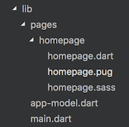
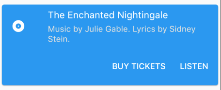

# Styling with CSS

## Structuring your files for styling

**You can use CSS or Sass to set any property to any class or id in your Pug or HTML file.**

To do so, create a style file with the same name as your Pug or HTML file, in the same directory. For example, if you have a startpage.pug, to style it simply add a startpage.sass in the same directory.

Recommendation: create a directory per layout, with the name of your layout. Then inside, create a pug file, sass file and your model and other supporting files.

Example structure:



See the[ example projects](../get-started/examples.md) for more ideas for structuring your application.

## Applying styles as properties

**You can apply extra properties to html elements by adding them through style rules.**

For example, given the following Pug:

```c
.message hello!
```

This will translate into the following HTML:

```markup
<div class="message">hello!</div>
```

You can then use the `.message` class to assign properties using Sass or CSS:

```css
.message
    width: 200
    height: 200
```

The resulting Dart will be a combination of your layout and style:

```dart
Container(
  child: Text( 
    'hello!',
  ),
  width: 200,
  height: 200,
);
```

## Setting expressions

**You can set an expression in CSS by wrapping the expression in quotes and starting it with a colon.**

It is recommended to keep Dart expressions in your Pug files. However, in some cases it can be practical to be able to set an expression as a value, for example if flutter-view does not have special support for it.

Say you want to achieve the following Dart:

```dart
Table( 
    defaultVerticalAlignment: TableCellVerticalAlignment.middle,
    children: [ ... ]
)
```

Which you can achieve with the following Pug code:

```css
table(:default-verticle-alignment='TableCellVerticalAlignment.middle')
    ...children...
```

Now let's move the `defaultVerticleAlignment` property into a Sass file:



```css
table
    default-verticle-alignment: ':TableCellVerticalAlignment.middle'
```



```css
table
    ...children...
```



Note the colon before `TableCellVerticleAlignment.middle`in the pug file.

## Using shortcut properties in styles

**Flutter-view provides many shortcut properties, that let you style in a CSS-style manner.**

Some examples are [color](../reference/css-properties.md#color-color), [padding](../reference/css-properties.md#padding), [margin](../reference/css-properties.md#margin) and [background-image](../reference/css-properties.md#box-shadow-1).

See the [shortcut properties reference](../reference/css-properties.md) for the full list.

As an example, consider the following Pug layout we want to style \(taken and converted into flutter-view Pug from the [Flutter Card sample](https://docs.flutter.io/flutter/material/Card-class.html)\):

```text
card
    column
        list-tile
            icon(as='leading' :value='Icons.album')
            .title(as='title') The Enchanted Nightingale
            .subtitle(as='subtitle') Music by Julie Gable. Lyrics by Sidney Stein.
        button-theme:bar
            button-bar
                flat-button.tickets(@on-pressed='...')
                    .label Buy tickets
                flat-button.listen(@on-pressed='...')
                    .label Listen
```

We have a layout, and now we can style it. 

The "buy tickets" and "listen" FlatButtons we want to have uppercase text:

```css
flat-button
    .label
        text-transform: uppercase
```

We want the card to be blue and the column of the card to have `mainAxisSize: MainAxisSize.min`:

```css
card
    color: blue
    column
        main-axis-size: min
```

We want to give some padding to the title and subtitle, and give each slightly different colors:

```css
card
    $title-color: grey[300]
    list-tile
        .title
            color: white
            padding: 4 6
        .subtitle
            color: grey[100]
            padding: 2 6
```

Here is the end result:





```css
artist-card(flutter-view :on-buy-pressed :on-listen-pressed)    
    card
        column
            list-tile
                icon(as='leading' :value='Icons.album')
                .title(as='title') The Enchanted Nightingale
                .subtitle(as='subtitle') Music by Julie Gable. Lyrics by Sidney Stein.
            button-theme:bar
                button-bar
                    flat-button.tickets(@on-pressed='onBuyPressed()')
                        .label Buy tickets
                    flat-button.listen(@on-pressed='onListenPressed()')
                        .label Listen
```



```css
card
    color: blue
    column
        main-axis-size: min
    list-tile
        .title
            color: white
            padding: 4 6
        .subtitle
            color: grey[100]
            padding: 2 6
        flat-button
            .label
                text-transform: uppercase
```







As you can see, Sass is a very nice match with Pug, since you can retain the same structure. This makes it easy to find the matching styles to your pug elements.

